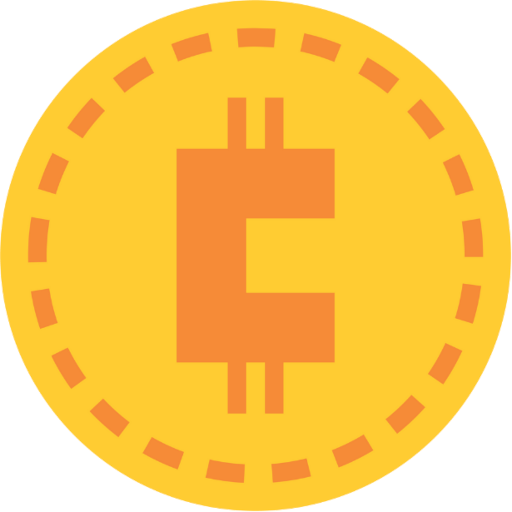
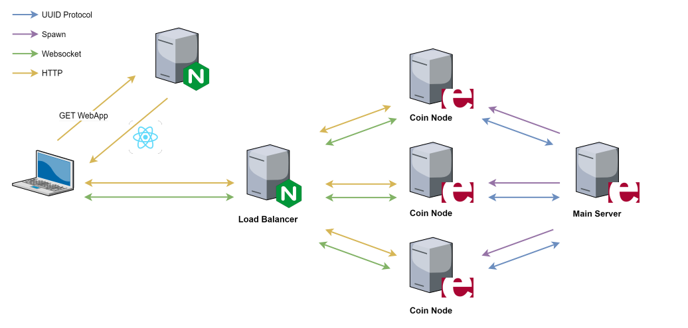
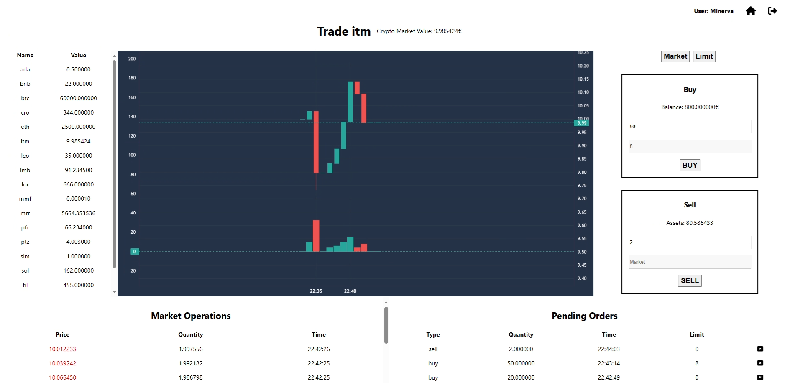

<p align="center">
  
</p>

# Distributed Cryptocurrency Exchange

University Project for "Distributed Systems and Middleware Technologies" course (MSc Computer Engineering @ University of Pisa). Implementation of a Distributed Cryptocurrency Exchange using `Erlang` and `ReactJs`.

## Overview

The application consists of a ***distributed cryptocurrency exchange*** composed by the following nodes: 
* The **Nginx server** to host the frontend webapp
* The **Nginx load balancer** between clients and backend
* Three **Coin Nodes** that handle client requests and provide the service
* The **Main Server** that creates and handles the cluster of nodes

<p align="center">
  
</p>

A **user** of the application can perform the follwing actions:
* Login/Logout
* Visualize a list of all assets associated with their market value
* Choose an asset and visualize its market value history
* Place buy and sell orders at current market value
* Place buy and sell orders at a desired market value
* Cancel pending orders
* Add money and assets to his/her wallet
* Visualize owned assets and available balance
* Visualize pending orders and transaction history

Below is an example of the GUI.
<p align="center">
  
</p>

## Getting Started

In order to deploy the project, **Docker Compose** is used. The deployed application can be accessed at url http://localhost.

Create and run containers:
```
docker compose -p distributed-cryptocurrency-exchange up -d --build
```

Stop and remove containers:
```
docker compose -p distributed-cryptocurrency-exchange down
```
## Project Architecture

```
Distributed-Crypocurrency-Exchange
├── docs
└── src
    ├── backend
    │   ├── coin_node
    │   ├── load_balancer
    │   └── mian_server    
    ├── frontend
    └── docker-compose.yaml
```

## Authors

* Biagio Cornacchia, b.cornacchia@studenti.unipi.it
* Gianluca Gemini, g.gemini@studenti.unipi.it
* Matteo Abaterusso, m.abaterusso@studenti.unipi.it